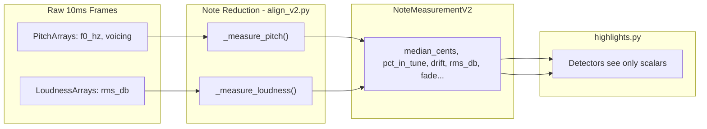
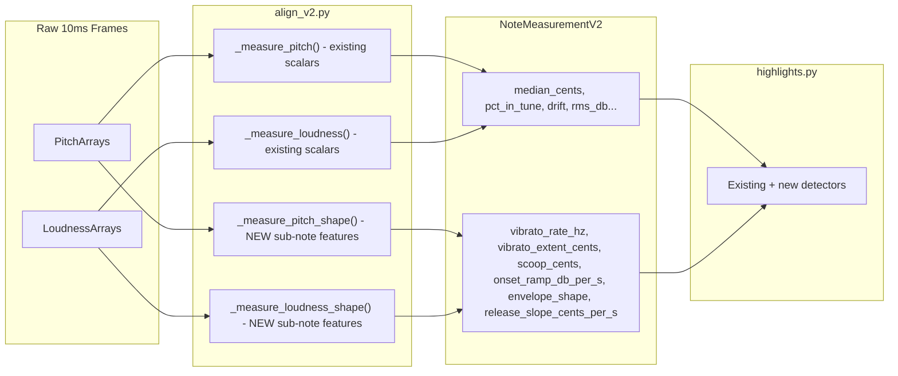

# Sprint 1.5: Continuous Signals and Cross-Dimensional Detection — Design Research

This sub-sprint is precursor work to Sprint 2, which will be improving the pedagogical grounding of feedback/highlights and using LLMs with retrieval augmented generation. The work done here opens up the types of highlights we can support rather than 4 rigid categories of Pitch, Volume, Timing, Technique

---

## Current Architecture Constraints

Today, the pipeline has a hard reduction boundary. Raw 10ms frame arrays (`PitchArrays`, `LoudnessArrays`) are available inside [align_v2.py](vocal_coach/align_v2.py), but `_measure_pitch()` (line ~349) and `_measure_loudness()` (line ~666) collapse each note to a handful of scalars on `NoteMeasurementV2`:

- **Pitch:** `median_cents`, `pct_in_tune`, `drift_cents_per_s`, `voiced_coverage`
- **Loudness:** `user_rms_db`, `ref_rms_db`, `rms_delta_db`, `rms_fade_db_per_s`
- **Technique:** binary flags + continuous scores per phoneme, aggregated to note-level max in `compare_note_techniques()`

Everything downstream — the entire [highlights.py](vocal_coach/highlights.py) detector layer — only sees `NoteMeasurementV2` rows. It has no access to within-note frame data, and no mechanism to correlate pitch with loudness or technique for a single note.

---

## Goal 1: Vocal Pedagogy Techniques Requiring Continuous or Combined Signals

Research and catalogue techniques from vocal pedagogy that the current scalar-per-note model cannot express, organized by what signal(s) they need.

### 1a. Continuous pitch (sub-note shape)

These require the actual F0 trajectory within a note, not just `median_cents`:

- **Vibrato characterisation** — Rate (Hz) and extent (cents) of regular pitch oscillation. Detectable via autocorrelation or FFT of the within-note cents curve. Pedagogically distinct from "pitch accuracy" — vibrato can be intentional and healthy, or nervous and unstable.
- **Scoop / pitch approach** — F0 starting significantly below (or above) target during the attack window and sliding into pitch. Common in pop/R&B, flagged as a habit to control in classical training.
- **Overshoot and settle** — Pitch briefly exceeding the target on onset then correcting. Often a belting registration issue.
- **Sustain stability (jitter)** — Variance or standard deviation of cents in the core window after trimming attack/release. Separates a steady tone from a wobbly one even when median is on-target.
- **Release trajectory** — How pitch exits the note (clean cutoff vs. a downward slide vs. vibrato fade). Pedagogically relevant to phrasing and legato.
- **Portamento / glide between notes** — Pitch continuity in the gap between consecutive notes. Requires looking at the inter-note region that the current core-window trimming explicitly discards.

### 1b. Continuous loudness (sub-note shape)

These require the RMS trajectory within a note, beyond the current `mean_rms_db` and `fade_db_per_s`:

- **Dynamic envelope shape** — Classifying the within-note loudness into archetypes: sustain (flat), crescendo (rising), decrescendo (falling), swell (rise-then-fall), sforzando (sharp peak at onset). `fade_db_per_s` captures only the linear slope, missing non-linear shapes.
- **Onset energy / attack transient** — How quickly loudness rises at the start of a note. A clean onset has a fast ramp; a breathy onset has a slow ramp with low initial voicing confidence.
- **Support consistency** — Variance of RMS across the sustained core. A well-supported note has low variance; a note losing support shows increasing variance.

### 1c. Cross-dimensional (pitch + loudness + technique combined)

These require reading multiple signals on the same note simultaneously:

- **Flat-with-fade (breath support diagnosis)** — A note that is both flat (`median_cents < -N`) and fading (`rms_fade_db_per_s < -X`) is almost always a breath support issue. The coaching copy should address support, not just pitch. Currently these fire as separate pitch and dynamics highlights.
- **Sharp-when-loud (registration strain)** — Notes that go sharp specifically when `user_rms_db` is high suggest the singer is pushing chest voice too high. The inverse (flat when quiet) suggests insufficient support.
- **Controlled crescendo** — A phrase where loudness increases (`rms_delta_db` positive across a window) AND pitch stays stable (`pct_in_tune` high, `drift` low). More meaningful than `dynamic_surge` alone because it confirms the singer maintained control during the volume push.
- **Vibrato only when loud** — Correlating STARS `vibrato` flags or student technique scores with `user_rms_db` across notes. Some singers only vibrate under pressure. Pedagogically worth surfacing.
- **Breathy onset + pitch scoop** — Combining low initial voicing confidence (from continuous pitch) with a rising F0 trajectory in the attack window. This is a stylistic signature in some genres and a control issue in others.
- **Technique density vs. pitch accuracy** — Sections or phrases where the user uses many techniques but pitch accuracy drops. May indicate overcommitting to expression at the expense of fundamentals.

---

## Goal 2: Incorporating Continuous Pitch and Loudness into the Pipeline

### Current bottleneck

`_measure_pitch()` and `_measure_loudness()` in [align_v2.py](vocal_coach/align_v2.py) are the single point where frame arrays are consumed. They return a flat dict of scalars, which `measure_note()` packs into `NoteMeasurementV2`. No frame-level data survives past this point.

### Proposed approach: sub-note feature extraction

Add a new extraction step alongside the existing scalar reduction. The raw frame arrays stay in `align_v2.py`; the new step computes **sub-note shape features** and stores them on `NoteMeasurementV2` as new Optional fields.

Concretely:

- **New function `_measure_pitch_shape()`** in [align_v2.py](vocal_coach/align_v2.py) — receives the same `(note, pitch, core_start, core_end)` args as `_measure_pitch()`. Computes:
  - `vibrato_rate_hz: Optional[float]` — dominant oscillation frequency of the cents curve (autocorrelation peak). **STARS compatibility note:** STARS already outputs a `vibrato` binary flag and technique score. This field should cross-reference the STARS signal rather than replace it — e.g. only compute when STARS has flagged vibrato, or use the STARS flag as a gate. Do not duplicate STARS vibrato detection.
  - `vibrato_extent_cents: Optional[float]` — amplitude of the vibrato oscillation (complementary to the STARS score, which does not express extent)
  - `scoop_cents: Optional[float]` — signed pitch offset at attack onset relative to the core median (negative = scoop from below). Minimum note duration: ~150ms of usable attack window.
  - `release_slope_cents_per_s: Optional[float]` — pitch trajectory in the final ~100ms of the note
  - *(deferred)* `sustain_jitter_cents` — std-dev of cents in the core window. Low priority for Sprint 2; re-evaluate after vibrato and scoop are shipped.
- **New function `_measure_loudness_shape()`** — receives `(note, loudness, start_s, end_s)`. Computes:
  - `onset_ramp_db_per_s: Optional[float]` — RMS slope in the first ~80ms
  - `envelope_shape: Optional[str]` — classification into `sustain`, `crescendo`, `decrescendo`, `swell`, `sforzando` based on simple heuristics (slope sign in first half vs second half)
  - *(deferred)* `sustain_rms_std` — std-dev of RMS in the core window. Deferred alongside sustain_jitter_cents.
- **New Optional fields on `NoteMeasurementV2`** in [schemas.py](vocal_coach/schemas.py) — one field per feature above, all `Optional` with `None` default for backward compatibility.
- `**measure_note()**` in [align_v2.py](vocal_coach/align_v2.py) calls both new functions and packs the results into the existing `NoteMeasurementV2` constructor.

This approach preserves the existing pipeline contract: `highlights.py` still only reads `NoteMeasurementV2` rows, but those rows now carry richer features. No raw frame arrays need to leak downstream.

---

## Goal 3: Cross-Dimensional Detection in the Highlight Pipeline

### Current detector structure

Every detector in [highlights.py](vocal_coach/highlights.py) reads one "dimension" of `NoteMeasurementV2`:

- Pitch detectors read `pct_in_tune`, `median_cents`, `drift_cents_per_s`
- Dynamics detectors read `rms_delta_db`, `rms_fade_db_per_s`
- Technique detectors read `NoteTechniqueComparison` lists
- No detector reads pitch + loudness + technique fields on the same note simultaneously

### Proposed approach: composite detectors

Add a new class of detectors that read multiple fields from `NoteMeasurementV2` (and optionally `NoteTechniqueComparison`) on the same note or window:

- `**detect_breath_support_issues()**` — scans for notes where `median_cents < -N` AND `rms_fade_db_per_s < -X` (or, with continuous features, `sustain_jitter > Y` AND `sustain_rms_std > Z`). Produces a `breath_support` moment type with coaching copy that addresses the root cause rather than the symptom.
- `**detect_registration_strain()**` — scans for notes in upper pitch ranges (high `midi_pitch`) where `median_cents > +N` AND `user_rms_db > track_median + X`. Produces a `registration_strain` moment.
- `**detect_controlled_crescendo()**` — phrase-window detector (like existing `detect_dynamic_surge`) but additionally requires high `pct_in_tune` across the window. Produces a more specific affirming moment: "You built volume while staying in tune."
- `**detect_vibrato_consistency()**` — using the new `vibrato_rate_hz` / `vibrato_extent_cents` fields, scan for phrases where vibrato is present but rate or extent varies wildly between notes. Compare against technique flags from STARS to distinguish intentional vibrato from pitch wobble.

### Category and basis classification

**Decision:** Use primary dimension routing in most cases — classify each composite moment under the dimension the coaching copy primarily addresses (e.g. `breath_support` → `pitch`, `controlled_crescendo` → `dynamics`). No new top-level category is introduced for Sprint 2, avoiding UI filter row changes.

For moments that are genuinely split across two dimensions equally (e.g. a moment that is fundamentally both a pitch and a dynamics issue), the moment should be assigned **two categories** and the UI should represent this as a gradient between the two category colours on the card and timeline block. This requires a small UI extension — `CoachingMoment.categories` becomes a list rather than a single string.

For `feedback_basis`, most cross-dimensional moments are `"absolute"` since they assess universal vocal technique. The exception would be any detector that incorporates reference comparison (e.g., "the reference uses a crescendo here and you don't").

### Integration point in select_highlights()

Cross-dimensional detectors plug into [highlights.py `select_highlights()](vocal_coach/highlights.py)` the same way existing detectors do — they return `list[CoachingMoment]` and are appended to the `candidates` list before the round-robin `_select_diverse()` call. No changes to the selection algorithm itself are needed.

---

## Deliverables

- This plan document (you are reading it)
- No code changes — Sprint 2 implements the features described above

## Sprint 2 Scoping Decisions

The following questions were resolved during Sprint 1.5 and should be treated as constraints during Sprint 2 implementation:

- **Feature priority** — Sprint 2 implements: vibrato characterisation, scoop detection, dynamic envelope shape classification, onset ramp, and release trajectory. Sustain jitter (`sustain_jitter_cents`, `sustain_rms_std`) is deferred.
- **STARS compatibility** — Sub-note features must be **complementary to STARS signals, not duplicative**. STARS already outputs `vibrato` and `glissando` signals. The new `vibrato_rate_hz` / `vibrato_extent_cents` fields should cross-reference or gate on the STARS vibrato flag rather than running a fully independent detector. The same principle applies to any future sub-note feature that overlaps a STARS output.
- **Category classification** — Use primary dimension routing by default. For moments that are genuinely split across two dimensions, assign two categories and render a gradient between those category colours on the card and timeline block (`CoachingMoment.categories: list[str]`).
- **Minimum note duration** — Per-feature thresholds: each feature independently returns `None` if the note is too short. Guidelines: vibrato needs ~300ms+ of core window; scoop needs ~150ms of attack window; onset ramp needs ~80ms.
- **Reference track features** — Compute sub-note shape features for both user and reference tracks, but only where the comparison adds clear pedagogical value. Do not compute STARS-overlapping features (vibrato, glissando) for the reference separately — use the STARS reference output instead.

