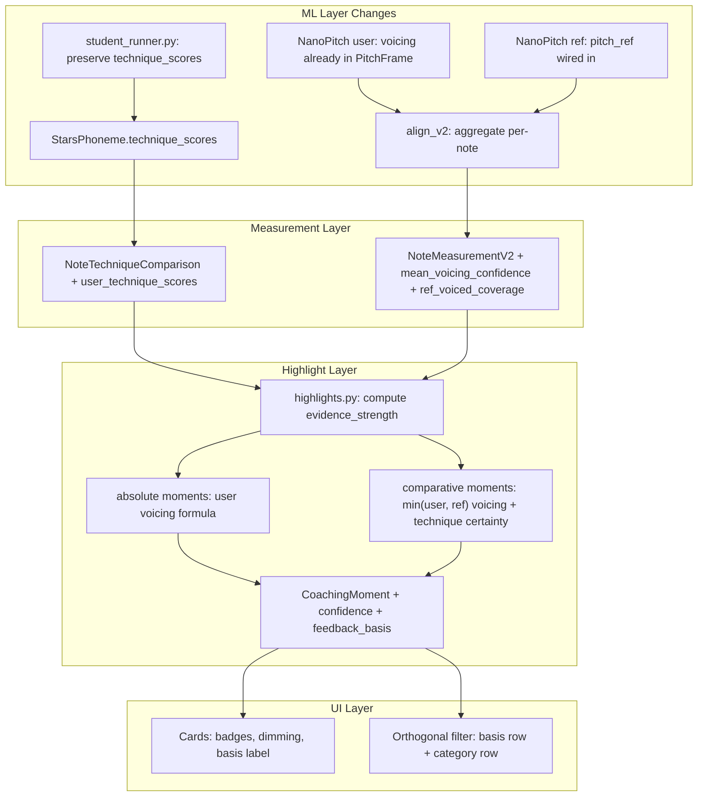

# Sprint 1: Confidence-Aware Feedback + Mimicry vs Quality

## Architecture Overview

Both features flow through the same pipeline layers: ML output -> per-note measurement -> highlight generation -> UI rendering. The changes thread new metadata through each layer without altering the core analysis logic.



---

## Feature 1a: Propagate Confidence Signals

### 1. Preserve STARS technique probabilities

**File: [student_runner.py](vocal_coach/student_runner.py)**

At ~line 269, `avg_arr` contains the continuous sigmoid probabilities before thresholding. Store these alongside the existing binary flags.

```python
# After computing avg_arr (line ~269):
technique_scores[name] = float(avg_arr[k])  # NEW: continuous
techniques[name] = int(avg_arr[k] >= thresh)  # existing binary
```

**File: [schemas.py](vocal_coach/schemas.py)** -- `StarsPhoneme`

Add a parallel field:

```python
technique_scores: Optional[dict[str, float]] = Field(
    None,
    description="Continuous sigmoid probability per technique (student only)",
)
```

### 2. Aggregate user voicing confidence per note

**File: [align_v2.py](vocal_coach/align_v2.py)**

In `_measure_pitch()`, compute `mean_voicing_confidence` as the mean of `voicing[slice]` over the note window frames (already available as the `PitchArrays.voicing` array).

**File: [schemas.py](vocal_coach/schemas.py)** -- `NoteMeasurementV2`

```python
mean_voicing_confidence: Optional[float] = Field(
    None,
    description="Mean NanoPitch voicing confidence across frames in the note window.",
)
```

### 3. Wire reference pitch to compute ref_voiced_coverage per note

Today `measure_song()` accepts `pitch_ref` but immediately discards it (`del pitch_ref`). Wire it through to compute per-note reference voiced coverage for use in comparative confidence.

**File: [align_v2.py](vocal_coach/align_v2.py)**

- Remove the `del pitch_ref` line (~line 794)
- Build a `ref_arrays = PitchArrays.from_track(pitch_ref)` alongside `user_arrays`
- Pass `pitch_ref_arrays` into `measure_note()` / `_measure_pitch()` to compute `ref_voiced_coverage` using the same frame-slicing logic as the user side
- The reference track is already in song time (recorded against the chart directly), so no offset shift is needed

**File: [schemas.py](vocal_coach/schemas.py)** -- `NoteMeasurementV2`

```python
ref_voiced_coverage: Optional[float] = Field(
    None,
    description="Fraction of reference frames inside the note window with voicing >= threshold. None when reference pitch is unavailable.",
)
```

### 4. Propagate technique scores to note level

**File: [align_v2.py](vocal_coach/align_v2.py)**

In `compare_note_techniques()`, compute per-note max technique score for each technique across overlapping user phonemes (max mirrors the existing OR logic for binary flags).

**File: [schemas.py](vocal_coach/schemas.py)** -- `NoteTechniqueComparison`

```python
user_technique_scores: Optional[dict[str, float]] = Field(
    None,
    description="Max continuous sigmoid score per technique across phonemes in the note window (user side, student only).",
)
```

No reference technique scores are needed -- reference flags already passed the teacher's 0.85 threshold, so reference technique presence can be treated as certain for evidence purposes.

---

## Feature 1b: Compute Per-Highlight Confidence

### 5. Evidence strength scoring

**File: [highlights.py](vocal_coach/highlights.py)**

Add a `_compute_evidence_strength()` function called after each moment is constructed. The formula differs based on `feedback_basis`:

**Absolute moments** (pitch, timing, dynamics -- user-only assessment):

```
evidence = 0.4 * mean_user_voiced_coverage
         + 0.3 * mean_user_voicing_confidence
         + 0.2 * duration_factor
         + 0.1 * technique_certainty  (if applicable, else user_voiced_coverage)
```

**Comparative moments** (expressive_match, missed_expression, expressive_moment, vocal_texture, section technique deltas -- require reliable signal on *both* sides):

```
dual_voicing = min(mean_user_voiced_coverage, mean_ref_voiced_coverage)
               # falls back to user_voiced_coverage if ref unavailable

evidence = 0.5 * dual_voicing
         + 0.3 * user_technique_certainty  (max student score for relevant technique)
         + 0.2 * duration_factor
```

The `min()` on dual voicing is deliberate: a comparative card is only as confident as its weakest side. If either singer was barely voiced in the window, the comparison is unreliable.

Map to tiers (tunable via `coaching.yaml`):
- **high**: evidence >= 0.65
- **medium**: 0.35 <= evidence < 0.65
- **low**: evidence < 0.35

### 6. Add confidence to CoachingMoment

**File: [schemas.py](vocal_coach/schemas.py)** -- `CoachingMoment`

```python
confidence: str = Field(
    "high",
    description='Evidence tier: "low", "medium", or "high".',
)
```

Add `evidence_strength` and `evidence_detail` to `moment.detail` dict.

### 7. Filter low-confidence in selection

**File: [highlights.py](vocal_coach/highlights.py)** -- `_select_diverse()`

Before round-robin selection, drop moments where `confidence == "low"`. This keeps the candidate pool clean without a separate pass.

**File: [coaching_config.py](vocal_coach/coaching_config.py)** + **[coaching.yaml](config/coaching.yaml)**

Add config:

```yaml
confidence:
  low_threshold: 0.35
  medium_threshold: 0.65
  suppress_low: true
```

---

## Feature 2: Mimicry vs Quality (feedback_basis)

### 8. Classify each moment type

**File: [highlights.py](vocal_coach/highlights.py)**

Add a `MOMENT_FEEDBACK_BASIS` dict alongside `MOMENT_CATEGORY`:

| feedback_basis = "absolute" (Technique Quality) | feedback_basis = "comparative" (Style Matching) |
|---|---|
| best_pitch_phrase | expressive_match |
| pitch_struggle | missed_expression |
| sharp_flat_note | expressive_moment |
| late_entrance | vocal_texture |
| timing_consistency | section_delta (technique drops) |
| fade_within_notes | |
| dynamic_drop | |
| dynamic_surge | |
| section_strength | |
| section_weakness | |
| best_overall_section | |
| weakest_overall_section | |
| section_dynamic_contrast | |

Set `feedback_basis` on each moment during construction, reading from this map.

### 9. Add feedback_basis to schema

**File: [schemas.py](vocal_coach/schemas.py)** -- `CoachingMoment`

```python
feedback_basis: str = Field(
    "absolute",
    description='"absolute" = technique quality, "comparative" = reference style matching.',
)
```

### 10. Adjust comparative card copy

**File: [highlights.py](vocal_coach/highlights.py)**

Soften language on comparative moment types:
- `missed_expression`: "Try more vibrato" -> "The reference uses vibrato here -- you took a different approach"
- `expressive_match`: Keep as-is (already affirming)
- `section_delta` (technique drops): Acknowledge stylistic choice: "...if you want to match the reference's style"

---

## Feature 3: UI Changes

### 11. Feedback basis filter row

**File: [index.html](web/static/index.html)**

Add a new filter row above the existing category badges:

```html
<div id="basisFilters" class="basis-filter-row" hidden>
  <button class="basis-filter-badge active" data-basis="all">All</button>
  <button class="basis-filter-badge" data-basis="absolute">Technique</button>
  <button class="basis-filter-badge" data-basis="comparative">Style</button>
</div>
```

### 12. Orthogonal filtering logic

**File: [app.js](web/static/app.js)**

- Add `activeBasisFilter` state (default: `"all"`)
- Map moment types to basis using `MOMENT_FEEDBACK_BASIS` dict (mirrors backend)
- Update `applyHighlightFilter()` to check both `activeHighlightFilter` (category) and `activeBasisFilter` (basis)
- Cards get `data-basis="absolute"` or `data-basis="comparative"` attribute

### 13. Confidence badges on cards

**File: [app.js](web/static/app.js)** -- `renderCoachingCards()`

- For `confidence === "medium"`: render an evidence badge element inside the card, e.g. "Based on limited evidence"
- For `confidence === "low"`: skip rendering (already filtered backend-side, but defensive)
- For `confidence === "high"`: no badge (clean default)
- Add confidence info to `detail` display in card footer

### 14. Visual styling

**File: [style.css](web/static/style.css)**

- `.basis-filter-row` styles (mirrors existing `.highlight-filter-badges` row)
- `.card.confidence-medium` -- subtle opacity reduction or border style change
- `.evidence-badge` -- small inline pill with muted styling
- `.card-basis-label` -- small tag showing "Technique" or "Style" on each card

---

## Backward Compatibility

- `StarsPhoneme.technique_scores` is `Optional` -- existing `stars.json` files without it deserialize cleanly
- `NoteMeasurementV2.mean_voicing_confidence` and `ref_voiced_coverage` are both `Optional` with default `None` -- old analysis files and songs without `reference_pitch_path` render identically
- `CoachingMoment.confidence` defaults to `"high"`, `feedback_basis` defaults to `"absolute"` -- old analysis files render identically
- `analysis_version` bumps from `"v3"` to `"v4"` to mark the schema evolution
- No changes to the reference build pipeline or NanoPitch output format (`voicing_confidence` is already in `reference/pitch.json`; we only wire reading of it into `measure_song()`)
- When `pitch_ref` is absent (song built without `--stars-profile`), comparative confidence falls back to user-only voicing

## Testing

- Extend [test_highlights.py](tests/test_highlights.py) with cases verifying:
  - Low-confidence moments are suppressed
  - Medium-confidence moments carry the badge
  - `feedback_basis` is correctly set for each moment type
- Run the existing analysis on stored performances (`data/songs/yesterday/performances/`) and inspect the new fields in `analysis.json`
