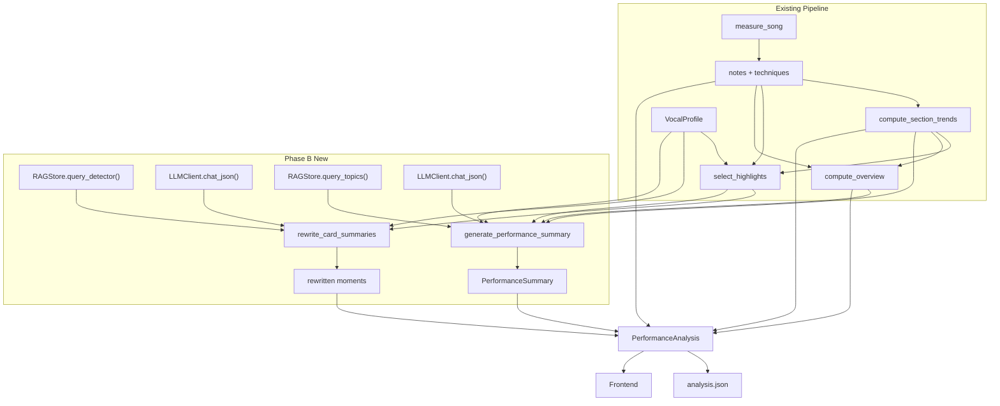

# Sprint 3 Phase B: LLM-Powered Feedback (Card Rewriting + Performance Summary)

Phase B consumes every Phase A output: `LLMClient`, `RAGStore`, `VocalProfile`, and the detector-keyed playbooks. It adds two batched LLM calls to the analysis pipeline, each with deterministic fallback and full audit logging.

---

## 1. Coaching Card Summary Rewriting

After `select_highlights()` returns the final `HighlightsReport`, pass all moments through a single batched LLM call to rewrite the `summary` field on each card.

### What changes on each card

- `**title**` -- stays deterministic (the existing f-string title). It already embeds lyrics and note names, which is the right level of specificity for a heading.
- `**summary**` -- replaced with LLM-generated coaching prose. The original f-string summary is preserved in `detail["deterministic_summary"]` for fallback and audit.
- **Lyrics** -- no change needed. The UI already renders lyrics independently via `lyricSnippet(reference, noteIndices)` from the reference annotation, not from the summary text. They will continue to appear on every card that has `note_indices`.

### Evidence schema per card

Each card's structured evidence is extracted from `CoachingMoment` fields and assembled into a JSON object for the prompt:

```python
{
  "id": "sharp_flat_note:42",
  "type": "sharp_flat_note",
  "feedback_basis": "absolute",
  "confidence": "high",
  "title": "Note on 'yesterday' is sharp",
  "measurements": {             # extracted from detail dict
    "median_cents": 38.0,
    "direction": "sharp",
    "note_name": "E4",
  },
  "lyric_context": "yesterday",  # from note_indices -> lyric_word
  "section": "Verse 1",          # from detail["section"]
  "playbook": "..."              # RAG-retrieved playbook passage
}
```

### Prompt structure

**System prompt**: Register-engineered coaching voice with the core constraint:

> You are a vocal coach giving technical, specific feedback on a singing performance. For each coaching card, write a 1-3 sentence summary that explains what happened, why it matters, and what to try next. Rules: (1) Only describe what the measurements show -- do not invent observations. (2) Be direct and technically precise, not vague or overly encouraging. (3) Reference specific notes, words, or sections when the evidence provides them. (4) When a playbook passage is provided, use its coaching language patterns and practice suggestions as guidance for tone and content.

The `VocalProfile.coaching_context` is appended to the system prompt to provide stylistic grounding (e.g. "This Beatles ballad emphasizes smooth legato phrasing...").

**User prompt**: JSON object containing the array of card evidence objects.

**Response schema** (Pydantic model for `chat_json`):

```python
class CardSummaryBatch(BaseModel):
    cards: list[CardSummary]

class CardSummary(BaseModel):
    id: str            # matches the CoachingMoment.id
    summary: str       # rewritten coaching prose
```

### RAG retrieval

For each moment in the batch, call `RAGStore.query_detector(moment.type, k=1)` to retrieve the most relevant playbook passage. This is done before the LLM call and included in the evidence object. Since playbook entries contain few-shot examples and coaching voice guidance, they ground the LLM's prose register without needing explicit few-shot examples in the system prompt.

### Fallback

If the LLM call returns `None` (key missing, API error, parse failure), every card keeps its original deterministic `summary` unchanged. No `detail["deterministic_summary"]` is written because no rewriting occurred. The pipeline never breaks.

### New module

Create `**[vocal_coach/feedback.py](vocal_coach/feedback.py)**` with:

- `rewrite_card_summaries(moments, *, llm, rag, vocal_profile, reference) -> list[CoachingMoment]` -- the batched card rewriting function
- `generate_performance_summary(moments, overview, sections, *, llm, rag, vocal_profile) -> Optional[PerformanceSummary]` -- the performance summary function (see section 2)
- Internal helpers: `_build_card_evidence()`, `_build_summary_prompt()`

### Token budget

The batched card call needs enough tokens for ~15 cards x ~60 words each = ~900 words. Set `max_tokens` to 2048 for the card batch call (override from `LLMConfig.max_tokens` which defaults to 1024). This is configurable.

---

## 2. Performance Summary with Trend Detection

After card rewriting, make a second LLM call that synthesizes all highlights and overview stats into a narrative performance summary.

### Output structure

```python
class PerformanceSummary(BaseModel):
    narrative: str          # 3-4 sentence overall assessment
    takeaways: list[str]    # 2-4 actionable bullet points
    trends: list[str]       # 1-3 observed cross-highlight patterns
```

- `**narrative**`: A short paragraph that gives the singer a holistic read on the performance -- what went well, what was challenging, and the overall trajectory.
- `**takeaways**`: Specific, actionable next steps prioritized by impact (e.g. "Focus on breath support through the second verse -- both pitch and volume are fading together there").
- `**trends**`: Cross-highlight patterns the LLM identifies by looking at all highlights in totality (e.g. "Your breathiness increased progressively from verse to verse", "Pitch accuracy dropped in every section that sits above A4").

### Prompt structure

**System prompt**: Coaching voice + evidence constraint + trend detection instruction:

> You are a vocal coach writing a performance summary. You have access to every coaching highlight from this performance, the overall statistics, and section-by-section trends. Your job is to: (1) Write a 3-4 sentence narrative assessment. (2) Identify 2-4 actionable takeaways, ordered by impact. (3) Identify 1-3 trends you observe across the highlights -- patterns that span multiple cards or sections. Rules: Only cite measurements and observations present in the data. Do not invent. Be specific and direct.

`VocalProfile.coaching_context` appended for stylistic grounding.

**User prompt**: JSON object containing:

```python
{
  "overview": {                    # from PerformanceOverview
    "mimic_score": 45.2,
    "pct_in_tune": 0.39,
    "technique_match_rate": 0.62,
    "voiced_coverage": 0.78,
    "arrival_offset_ms_mean": 42.0,
    "note_count": 196,
    "strongest_section": "Verse 3"
  },
  "sections": [                    # from SectionTrend list
    {"name": "Verse 1", "pct_in_tune": 0.45, "mean_rms_db": -12.3, ...},
    {"name": "Chorus 1", "pct_in_tune": 0.32, "mean_rms_db": -9.1, ...},
    ...
  ],
  "highlights": [                  # summarized from CoachingMoment list
    {"type": "pitch_struggle", "section": "Chorus 1", "summary": "..."},
    {"type": "breath_support_issue", "section": "Verse 2", "summary": "..."},
    ...
  ],
  "pedagogy_context": "..."       # RAG-retrieved pedagogy passages
}
```

### RAG retrieval for summary

Call `RAGStore.query_topics(topic_tags, k=5)` where `topic_tags` is derived from the highlight types present in the performance (e.g. if there are breath_support_issue and pitch_struggle highlights, query for `["breath_support", "pitch", "dynamics"]`). This provides pedagogical grounding for the narrative.

### Trend detection

The key to trend detection is giving the LLM visibility into **all highlights at once** with their **section locations and temporal ordering**. The prompt explicitly asks the LLM to look for:

- Progressive changes across sections (e.g. accuracy degrading over time)
- Co-occurring patterns (e.g. breath support issues always appearing with pitch problems)
- Section-type contrasts (e.g. consistently weaker in choruses than verses)
- Technique evolution (e.g. expression matching improving across repeated sections)

The section trends data (`SectionTrend` list) provides the per-section statistics that make these patterns visible.

### Fallback

If the LLM call returns `None`, `performance_summary` is set to `None` on `PerformanceAnalysis`. The UI hides the summary section and the numeric overview tiles remain as the only top-level summary.

---

## 3. Schema Changes

### `CoachingMoment` -- no schema change needed

The `detail` dict is already free-form. Phase B adds:

- `detail["deterministic_summary"]` -- original f-string summary (only when LLM rewriting succeeds)
- `detail["llm_evidence"]` -- the structured evidence object sent to the LLM (for audit)

### `PerformanceAnalysis` -- add `performance_summary`

```python
# In vocal_coach/schemas.py
performance_summary: Optional[PerformanceSummary] = Field(
    None,
    description='Sprint 3 Phase B: LLM-generated narrative + takeaways + trends.',
)
```

### New schema: `PerformanceSummary`

```python
class PerformanceSummary(BaseModel):
    narrative: str = Field(..., description='3-4 sentence overall performance assessment.')
    takeaways: list[str] = Field(default_factory=list, description='2-4 actionable next steps.')
    trends: list[str] = Field(default_factory=list, description='1-3 cross-highlight patterns observed.')
    model_used: str = Field("", description='OpenAI model ID for provenance.')
    generated_at: Optional[str] = Field(None, description='ISO-8601 timestamp.')
```

### Bump `analysis_version`

Change from `"v5"` to `"v6"` to reflect the new fields.

---

## 4. Pipeline Integration

### In `[scripts/analyze_performance.py](scripts/analyze_performance.py)` and `[web/api/main.py](web/api/main.py)`

After the existing pipeline (measure_song -> section_trends -> select_highlights -> compute_overview), add:

```
1. Load LLM client from config (or reuse from vocal profile step)
2. Load RAG store (connect to chroma_db)
3. rewrite_card_summaries(highlights.moments, llm=llm, rag=rag,
                          vocal_profile=profile, reference=reference)
4. summary = generate_performance_summary(highlights.moments, overview,
                                           section_trends, llm=llm, rag=rag,
                                           vocal_profile=profile)
5. Assign analysis.performance_summary = summary
6. Write analysis.json (unchanged path)
```

Both steps are skipped gracefully if `llm` is `None` (no API key or LLM disabled).

### Config additions

Add to `LLMConfig` in `[coaching_config.py](vocal_coach/coaching_config.py)`:

```python
card_rewrite_max_tokens: int = 2048
summary_max_tokens: int = 1024
```

And corresponding entries in `config/coaching.yaml` under `llm:`.

---

## 5. UI Changes

### Performance summary section

Add a new `<div id="performanceSummary">` in `[web/static/index.html](web/static/index.html)` between the overview tiles and the coaching highlights heading. Rendered by a new `renderPerformanceSummary(analysis.performance_summary)` function in `[web/static/app.js](web/static/app.js)`.

Layout:

- **Narrative paragraph** -- the 3-4 sentence assessment, styled as a callout/blockquote
- **Takeaways** -- an ordered list of actionable steps, each as a short bullet
- **Trends** -- a secondary list of observed patterns, visually distinct from takeaways (perhaps italic or in a muted panel)
- Hidden when `performance_summary` is `null`

### Card summary styling

LLM-rewritten summaries may be slightly longer than the f-string originals. No structural HTML change needed -- the `.card-summary` element already renders free text. Optionally add a small "AI-generated" indicator or a subtle visual distinction (e.g. a small icon or different font weight) to signal that the summary is LLM-produced vs. deterministic.

### Styles

Add new CSS rules in `[web/static/style.css](web/static/style.css)` for `.performance-summary`, `.summary-narrative`, `.summary-takeaways`, `.summary-trends`.

---

## 6. Audit Logging

Both LLM calls log their inputs and outputs into `analysis.json` for traceability:

- Card rewriting: each moment's `detail["llm_evidence"]` stores the evidence object sent to the LLM; `detail["deterministic_summary"]` stores the original template summary
- Performance summary: the `PerformanceSummary` model includes `model_used` and `generated_at` for provenance
- If needed for deeper debugging, the full prompt can be logged to a separate file (`data/songs/<song_id>/performances/<perf_id>/llm_audit.json`) rather than bloating `analysis.json`

---

## 7. Testing Strategy

- `**feedback.py` card rewriting**: Unit test with mocked LLM; verify deterministic fallback preserved in `detail["deterministic_summary"]`; verify LLM summary replaces `summary` field; verify batch response is correctly matched by `id`
- `**feedback.py` performance summary**: Unit test with mocked LLM; verify `PerformanceSummary` schema compliance; verify `None` fallback
- **Integration**: End-to-end test with mocked LLM on the "yesterday" song bundle; verify `analysis.json` contains both rewritten summaries and `performance_summary`
- **UI**: Manual verification that summary section appears/hides correctly; card summaries render properly

---

## 8. Data Flow




---

## 9. Files Changed Summary

- `vocal_coach/feedback.py` -- **New**: card rewriting + performance summary generation
- `vocal_coach/schemas.py` -- Add `PerformanceSummary` model; add `performance_summary` field to `PerformanceAnalysis`; bump `analysis_version` to `"v6"`
- `vocal_coach/coaching_config.py` -- Add `card_rewrite_max_tokens` and `summary_max_tokens` to `LLMConfig`
- `config/coaching.yaml` -- Add new token limit fields under `llm:`
- `scripts/analyze_performance.py` -- Wire in `rewrite_card_summaries()` and `generate_performance_summary()` after existing pipeline
- `web/api/main.py` -- Same wiring for the web API path
- `web/static/index.html` -- Add `performanceSummary` div
- `web/static/app.js` -- Add `renderPerformanceSummary()` function; minor card rendering updates
- `web/static/style.css` -- Styles for performance summary section
- `tests/test_feedback.py` -- **New**: unit tests for both LLM feedback functions

